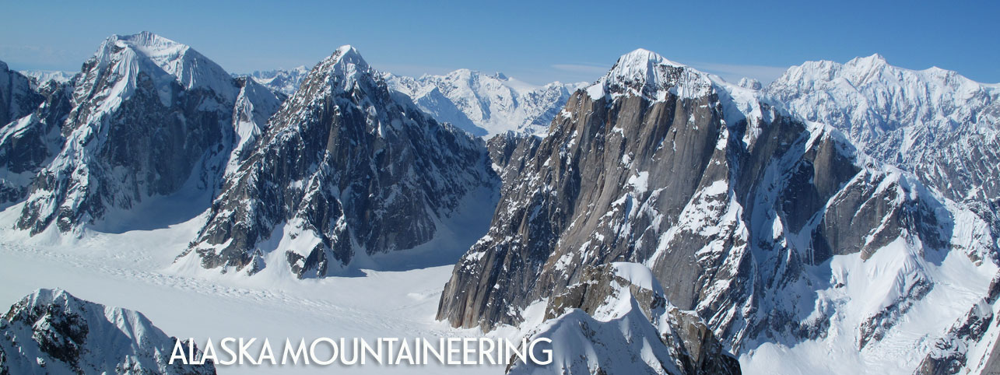

# Alaska Expedition Planner



A comprehensive web application for planning expeditions to the Ruth Gorge glacier in the Alaska Range. This tool provides detailed information on climbing routes, seasonal conditions, logistics, and expedition planning resources.

## Features

- **Route Database**: Detailed information on climbing routes in the Ruth Gorge area with filtering capabilities by difficulty, length, and climbing style
- **Authentic Route Images**: Real photographs of classic routes like Ham and Eggs, Blue Collar Beatdown, and Japanese Couloir
- **Seasonal Conditions**: Overview of weather patterns and optimal climbing windows throughout the year
- **Interactive Map**: Visualization of routes, camps, and key landmarks in the Ruth Gorge
- **Calendar Planner**: Schedule creation tool for expedition timeline with conflict detection
- **Budget Calculator**: Estimate costs for your expedition with itemized breakdowns
- **Packing Checklist**: Customizable gear lists specific to Alaskan expeditions with weight calculations
- **Logistics Information**: Air taxi services, contact information, permits, and approach details

## Getting Started

1. Clone this repository:
   ```
   git clone https://github.com/yourusername/alaska-expedition-planner.git
   cd alaska-expedition-planner
   ```

2. Install dependencies:
   ```
   npm install
   ```

3. Start the development server:
   ```
   npm start
   ```

4. Build for production:
   ```
   npm run build
   ```

## Technologies Used

- React.js - Frontend framework
- Material UI - Component library for consistent design
- React Router - Navigation and routing
- Chart.js - Data visualization

## Data Sources

Information compiled from various mountaineering resources including:
- American Alpine Journal
- Mountain Project
- Climbing Magazine
- Alaska Mountain Guides
- Talkeetna Air Taxi
- Alaska Alpine Adventures
- Local expedition reports and firsthand accounts
- National Park Service - Denali National Park and Preserve

## Featured Routes

- **Ham and Eggs** (WI4 M1 5.7, 2,500ft) - A classic ice climb on the Mooses Tooth
- **Japanese Couloir** (AI3 55°, 3,000ft) - An elegant line on Mount Barrill
- **Shaken Not Stirred** (WI5 M7, 3,000ft) - A challenging mixed line on the Mooses Tooth
- **Blue Collar Beatdown** (WI3 M5 5.9, 1,500ft) - A modern mixed route
- **Right Couloir** (55° snow, 2,000ft) - A moderate ski mountaineering objective

## License

This project is intended for personal use in expedition planning.

## Acknowledgements

Thank you to all the climbers who have documented their experiences in the Alaska Range, helping make this planning tool possible. Special thanks to the guides and pilots who provide safe access to these remote mountains.
